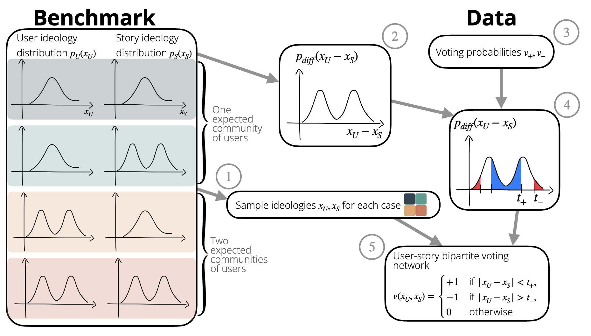

# Untangling co-voting patterns on online social media
Repository for the paper "Community detection on signed bipartite networks".
***

## Paper abstract

Community detection has been a widely studied problem in network science over the last few decades. Scholars have developed methods that consider several network properties, such as the strength of interactions quantified as an edge weight. Signed networks are a generalization of weighted networks, allowing for both positive and negative interactions. Due to the existence of a few community detection methods in the literature suitable for signed networks, we have created a pipeline to test their effectiveness in the case of bipartite networks with positive and negative links.
Signed bipartite networks are prevalent in various domains, including social media interactions and political voting processes. Existing research on signed bipartite networks has primarily focused on defining Structural Balance within a bipartite network, leaving a gap in understanding community detection on such networks.  We develop a benchmark featuring synthetic data and real-data signed bipartite networks with known divisions. The benchmark is devoted to evaluating the accuracy of community detection methods. This work tests the benchmark on datasets from the US House of Representatives votes and the Menéame social media platform. The study aims to contribute to the understanding of signed bipartite networks, particularly in the context of social media interactions, where negative interactions are often overlooked.
We find that existing community detection methods correctly capture synthetic-generated scenarios under parameter tuning, while they yield discordant results on Menéame data. In contrast, they correctly identify political parties in the US House of Representatives co-voting networks.

## Synthetic Networks Benchmark



## Repository installation
Clone this repository with the command
```
 git clone https://github.com/elenacandellone/signed-bipartite-nets.git
```

## Presentations
- ODISSEI Conference 2023  [](https://doi.org/10.5281/zenodo.10060900)
- Young Complexity Researchers Utrecht


## Scripts
* `1-us-house-scrape-data.py` scrapes data from the website of the [US House of Representatives Clerk](https://clerk.house.gov/) and saves the votes in the *data* folder. 
* `2a-us-house-covoting.py` creates the co-voting network for the US House of Representatives data.
* `2ab-meneame-covoting.py` creates the co-voting network for the Meneame data.
* `3-synth-nets.ipynb` generates the synthetic networks based on the four controlled scenarios and insights from real data.
* `4-community-detection.py` performs the community detection using several methods on both real and synthetic networks.
* `5-analysis.ipynb` results of the clustering evaluation.

<!-- CONTACT -->

## Contact
- Elena Candellone [e.candellone@uu.nl](mailto:e.candellone@uu.nl)
- Javier Garcia-Bernardo
- Erik-Jan van Kesteren

Project by the [ODISSEI Social Data Science (SoDa)](https://odissei-data.nl/nl/soda/) team.

