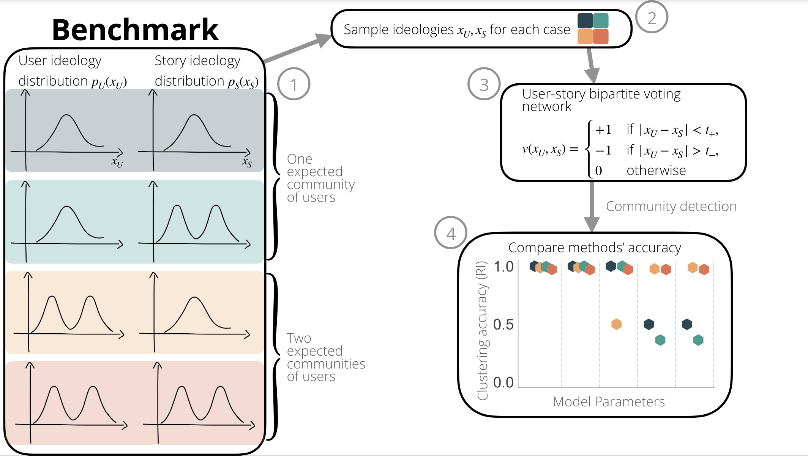

# Community detection on bipartite signed networks
Repository for the paper "Community detection in bipartite signed networks is highly dependent on parameter choice".
***

## Paper abstract

Decision-making processes often involve voting. Human interactions with exogenous entities such as legislations or products can be effectively modeled as two-mode (bipartite) signed networks---where people can either vote positively, negatively, or abstain from voting on the entities.
Detecting communities in such networks could help us understand underlying properties: for example ideological camps or consumer preferences.
While community detection is an established practice separately for bipartite and signed networks, it remains largely unexplored in the case of bipartite signed networks. In this paper, we systematically evaluate the efficacy of community detection methods on bipartite signed networks using a synthetic benchmark and real-world datasets. Our findings reveal that when no communities are present in the data, these methods often recover spurious communities. When communities are present, the algorithms exhibit promising performance, although their performance is highly susceptible to parameter choice. This indicates that researchers using community detection methods in the context of bipartite signed networks should not take the communities found at face value: it is essential to assess the robustness of parameter choices or perform domain-specific external validation.

## Synthetic Networks Benchmark



## Repository installation
Clone this repository with the command
```
 git clone https://github.com/elenacandellone/signed-bipartite-nets.git
```
Install the required packages
```
pip install -r requirements.txt
```

## Scripts
* `1-us-house-scrape-data.py` scrapes data from the website of the [US House of Representatives Clerk](https://clerk.house.gov/) and saves the votes in the *data* folder. 
* `2a-us-house-covoting.py` creates the co-voting network for the US House of Representatives data.
* `2b-meneame-covoting.py` creates the co-voting network for the Meneame data.
* `3-synth-nets.ipynb` generates the synthetic networks based on the four controlled scenarios and insights from real data.
* `4-community-detection.py` performs the community detection using several methods on both real and synthetic networks.
* `5a-analysis.ipynb` results of the clustering evaluation for community-spinglass and SPONGE.
* `5b-analysis-sbm.ipynb` results of the clustering evaluation for SBM.

## Presentations
- ODISSEI Conference 2023  [](https://doi.org/10.5281/zenodo.10060900)
- Young Complexity Researchers Utrecht [[link](https://www.uu.nl/en/events/young-complexity-researchers-lunch-ycrl-13-community-detection-on-signed-networks-untangling-co)]

## How to cite
E. Candellone, E. van Kesteren, S.Chelmi, J. Garcia Bernardo. Community detection in bipartite signed networks is highly dependent on parameter choice, 2024.


## Contact
- Elena Candellone [e.candellone@uu.nl](mailto:e.candellone@uu.nl)
- Javier Garcia-Bernardo
- Erik-Jan van Kesteren

Project by the [ODISSEI Social Data Science (SoDa)](https://odissei-data.nl/nl/soda/) team.

